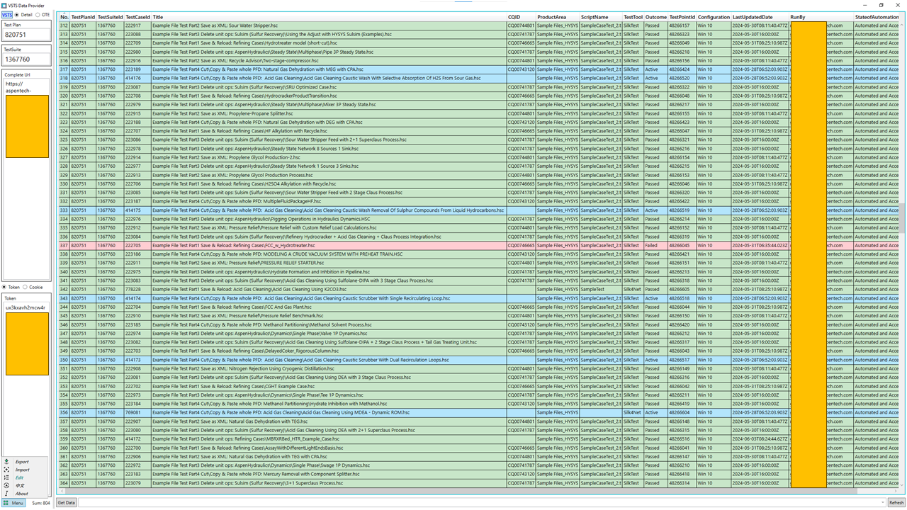
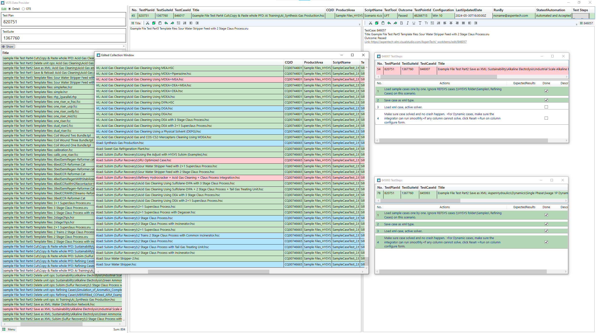

# DataRetriever

A desktop application for retrieving test plans/suites/cases from various sources and displaying them in a user-friendly way.

Then, it can be used to generate test cases lists for automation testing.

UI and functions:

1. Main window

    

2. Edit window

    